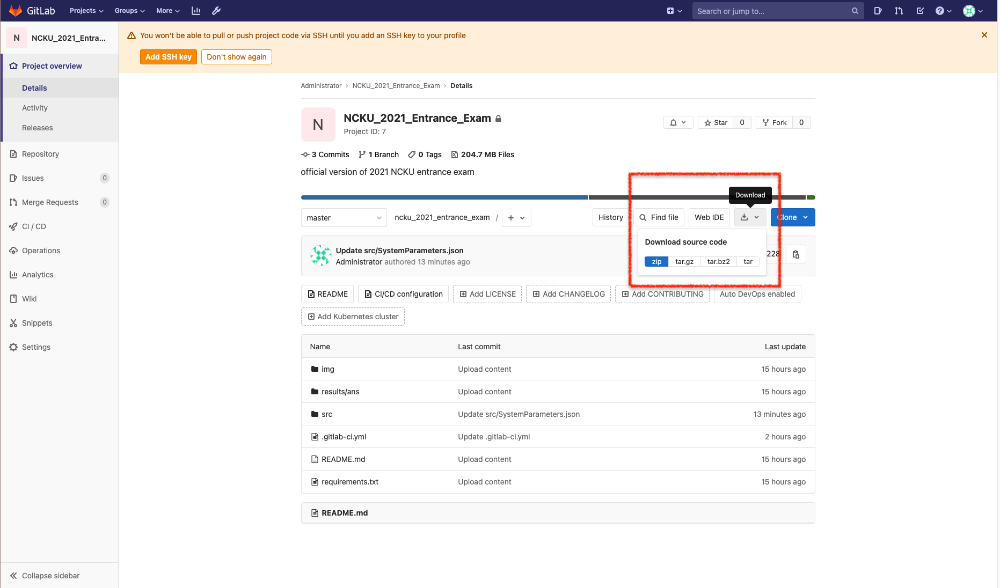
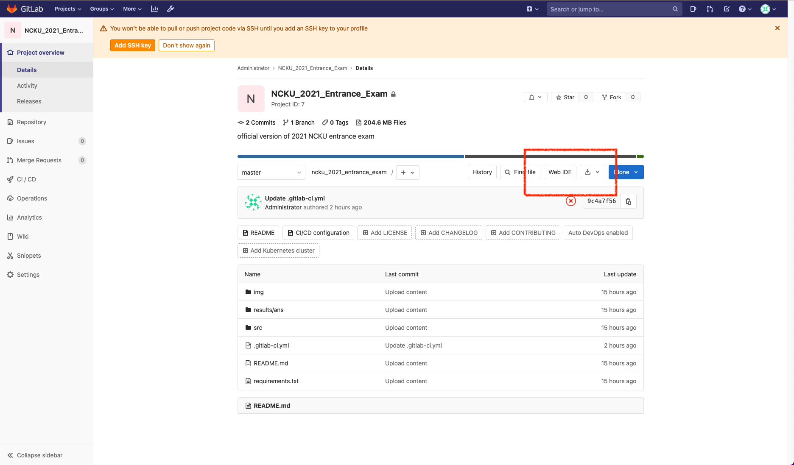
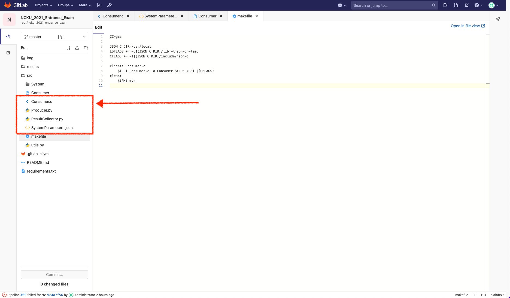
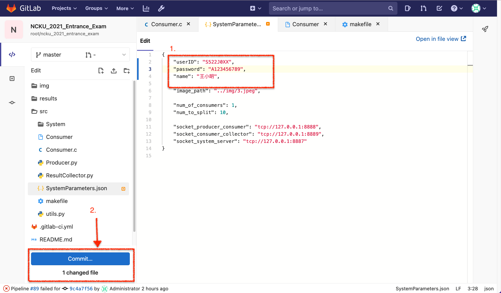
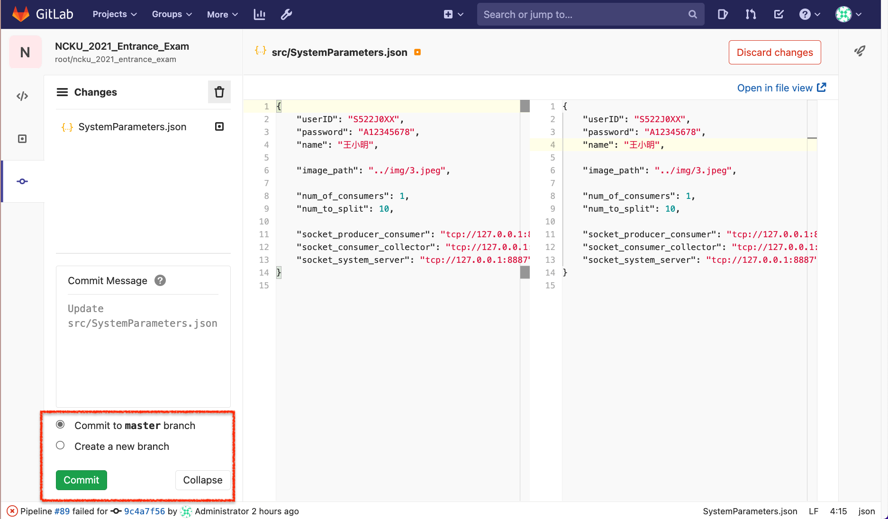
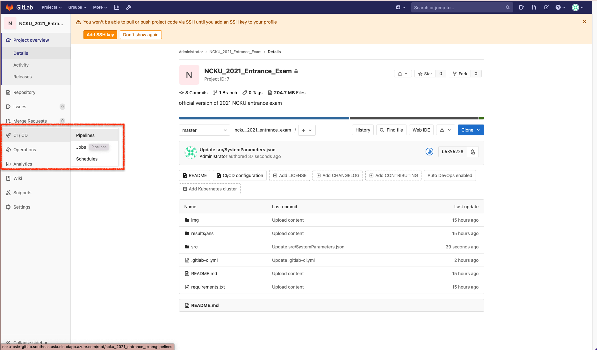
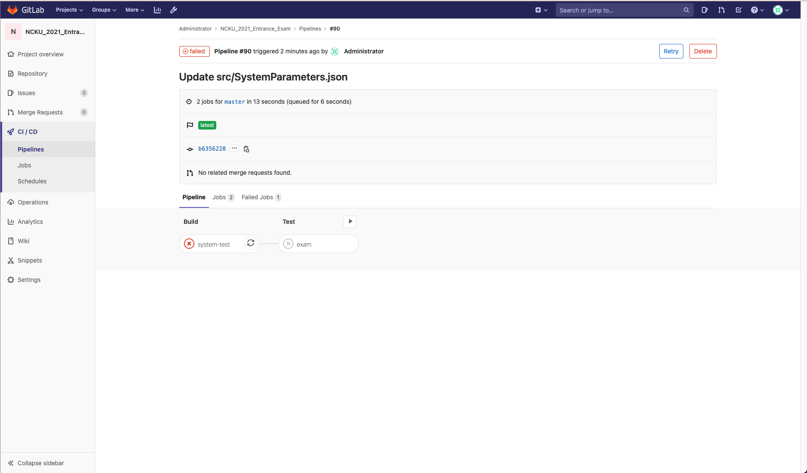
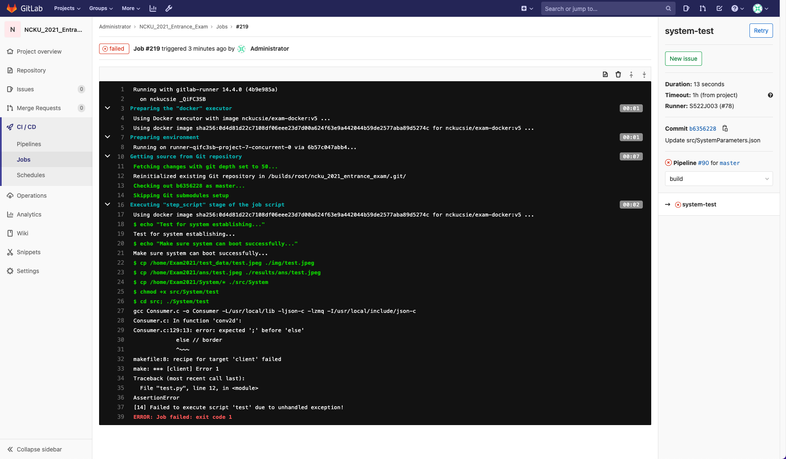
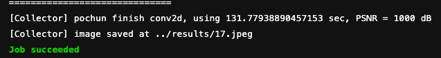

# 考前須知與注意事項

## 設備確認
請先確認自身座位設備是否異常，若有任何問題請舉手，會有監考人員協助
- [ ] 電腦可以正常開機
- [ ] 鍵盤滑鼠皆可正常使用
- [ ] 網路連線正常 (僅本考試提供之網域可以連線，詳細請參照[本表](https://hackmd.io/XWt0TYKwS92GFsW-D0OJKA?view#%E9%99%84%E9%8C%84%E4%B8%80))
    - [點擊測試](https://en.cppreference.com/w/c/language)

## 本地端環境測試
到桌面名為 `DemonstrationCode` 的 `src/` 資料夾下，執行 `System/run`，即可執行測試程式。確認本地端環境無執行沒有問題。若失敗請舉手通知監考人員。

## 程式庫系統
### 系統登入
1. 請使用**准考證號碼**作為使用者名稱與**身分證字號**作為密碼登入系統
    * ncku-csie-gitlab.southeastasia.cloudapp.azure.com
2. 登入後即可看到名為 ```Exam-2021/NCKU_2021_Entrance_Exam``` 的專案資料夾

### 下載程式

考生可以將程式下載至本地端進行開發，再行上傳，或者直接使用 Web IDE 編輯



### 繳交程式
1. 在 GitLab 專案上，選擇 Web IDE

   

2. 點選上傳檔案符號

3. 將 ```src/``` 資料夾下的 ```Consumer.c```, ```SystemParameters.json```, ```Producer.py```, ```ResultCollector.py``` 四個檔案移除再上傳

   

   

4. 確認 `SystemParameters.json` 中，`userID` 為自己的准考證號碼，`password `為身證字號，`name` 為自己的姓名

   

5. 選擇 main branch，然後送出 commit，及繳交完成

   

### 程式狀態
1. 繳交完程式後，可以在 GitLab 專案主頁面，點選 CI/CD -> Pipelines 選項

   

2. 可以看到方才繳交的程式正在進行驗證

   

3. 點擊 Build 或 Test 查看詳細資訊

  

  * **Build - System** 是系統測試

  * **Test - Exam** 實際運行測資，須先通過系統測試方得運行 **Test - Exam**

4. Job succeeded 且 **PSNR** 大於 40dB 者，則該次成績將會儲存作為成績紀錄（取最高者）

   

## 成績評定
最終成績以所有上傳的版本中，**成功**且**效能最佳**的版本作為排名依據

詳細請見考試文件。


## 附錄：可參考之網站一覽表

1. https://en.cppreference.com/w/c/language 
2. https://devdocs.io/c/
3. https://docs.python.org/3.8/
4. https://zeromq.org/
5. https://pyzmq.readthedocs.io/en/latest/
6. https://learning-0mq-with-pyzmq.readthedocs.io/en/latest/index.html 
7. http://api.zeromq.org/
8. https://json-c.github.io/json-c/json-c-0.15/doc/html/index.html
9. https://docs.python.org/3/library/json.html
10. https://numpy.org/